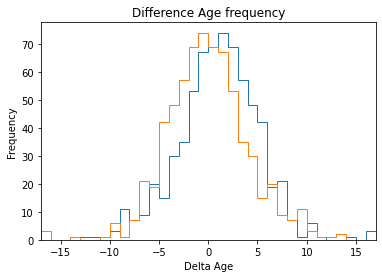
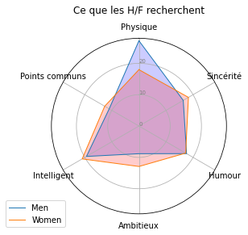
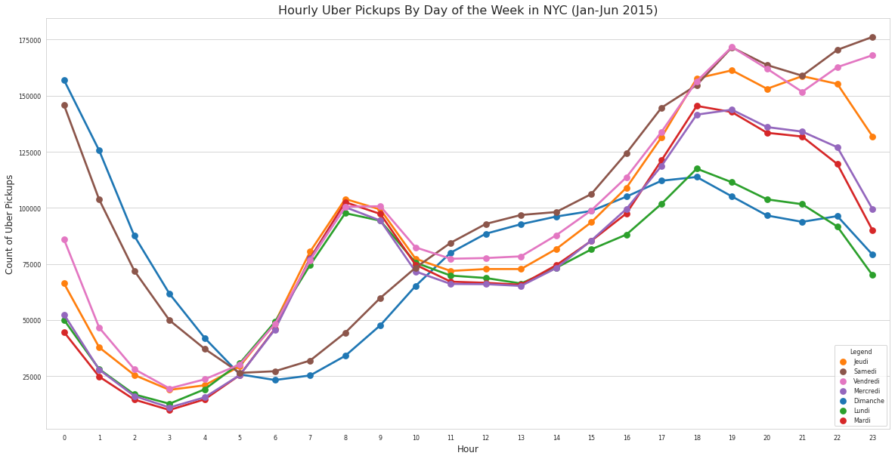
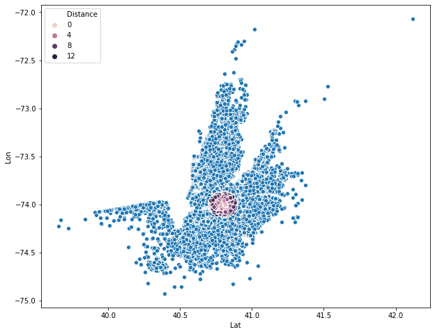
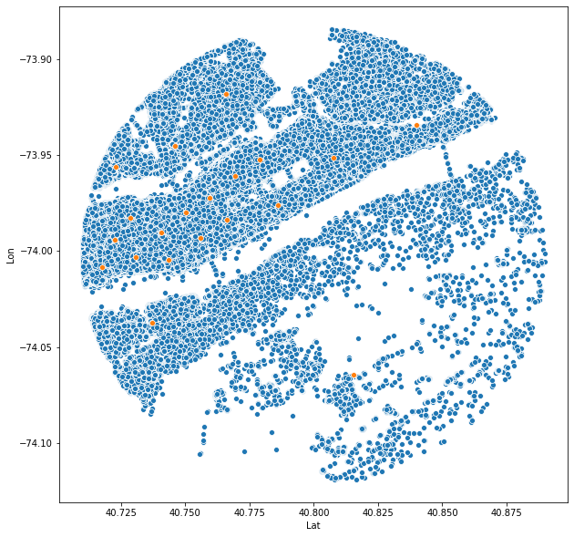

# Data Science Portfolio - EL AZIMANI Volodia
 
This is the repository of the projects I worked or currently working on. It is updated regularly. The projects are either written in Python (Google Colab or Jupyter Notebook). Click on the projects folder to see full analysis and code.

Please contact me on [Linkedin](https://www.linkedin.com/in/volodia-el-azimani-459b99142) if you are looking to hire a data scientist.

## 1.   Speed Dating Project - Data Visualization

In this project, we use the data from a Speed Dating Challenge.
It summerize my Data Visualization skills with seaborn and matplotlib.

*   Influence of some parameters on a match
*   Difference between Male and Female thinkings
*   Caracteristics of Super Matcher
*   Own thinking VS Perceived image

   

## 2.   Convertion Rate Project 

This project is about the analyze of converted people on a online shopping website.

*   Influence of some parameters on a match
*   Difference between Male and Female thinkings

## 3.   Uber Driver Project

For this project I had at my disposal data concerning thousands of Uber races in the city of NYC during the periods January-June 2014 and January-June 2015.
The goal of this project was to be able to generate a map of the most interesting places for the drivers according to their location and date/time.
For this, I used the clustering method of K-means and DBSCAN.

*   Influence of Bases (Drivers company working for Uber) in NYC.
*   Data cleaning and selection.
*   K-Means clustering
*   DBScan clustering 

   
